<h1 align="center">
  <a href="https://github.com/GITHUB_USERNAME/REPO_SLUG">
    <!-- Please provide path to your logo here -->
    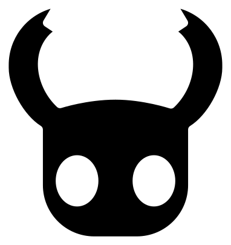
    <!-- Please provide path to your logo here -->
    
  </a>
</h1>

<div align="center">
  SHADE KNIGHT
  <br />
 
  <br />
  
</div>

<div align="center">
<br />


</div>

<details open="open">
<summary>Tabla de Contenidos/Table of Contents</summary>

- [Sobre/About](#sobre--about)
  - [Trailer](#trailer)
  - [Capturas de Pantalla/Screenshots](#capturas-de-pantalla--screenshots)
  - [Hecho con/Built With](#hecho-con--built-with)
- [Empezando/Getting Started](#empezando--getting-started)
  - [Requisitos previos/Prerequisites](#requisitos-previos--prerequisites)
  - [Instalación/Installation](#instalaci%C3%B3n--installation)
- [Utilización/Usage](#utilizaci%C3%B3n--usage)
- [Contribuciones/Contributing](#contribuciones--contributing)
- [Autores y contribuyentes/Authors & contributors](#autores-y-contribuyentes--authors--contributors)
- [Licencia/License](#licencia--license)
- [Reconocimientos/Acknowledgements](#reconocimientos--acknowledgments)

</details>

---

## Sobre / About

> Este proyecto es un tributo a Hollow Knight, juego desarrollado por Team Cherry, y una primera incursión a la programación en Python y el uso de la biblioteca de Pygame. 

> This project is a tribute to Hollow Knight, developed by Team Cherry, and a first incursion into python programming and the use of the Pygame library.

---
## Trailer
<br>

[](https://youtu.be/tKbgiL7NpO4)


---
## Capturas de Pantalla / Screenshots
<br>


|                        Menu Principal/Main Menu                       |                         Jugabilidad/Gameplay                           |
| :-------------------------------------------------------------------: | :--------------------------------------------------------------------: |
| 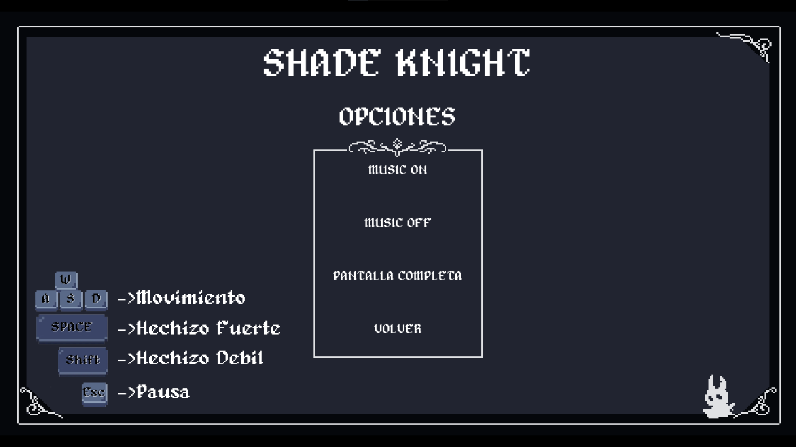  | 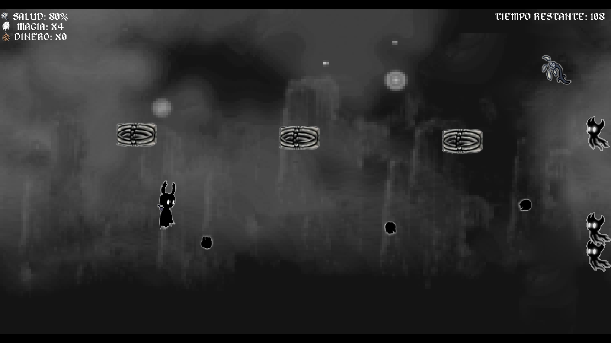  |
|                           Puntajes/Rankings                           |                         Jugabilidad/Gameplay                           |
|  |  |
| 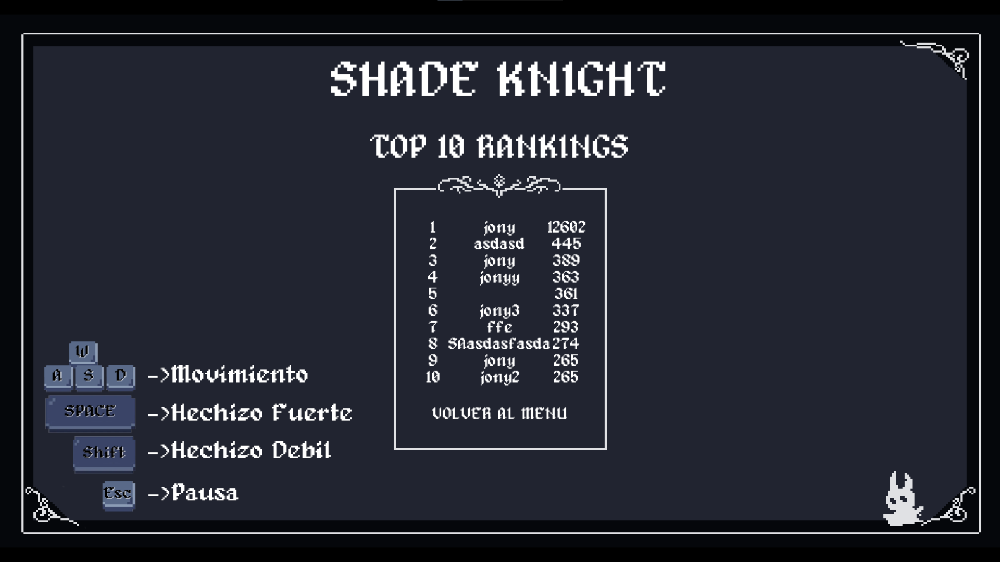    | 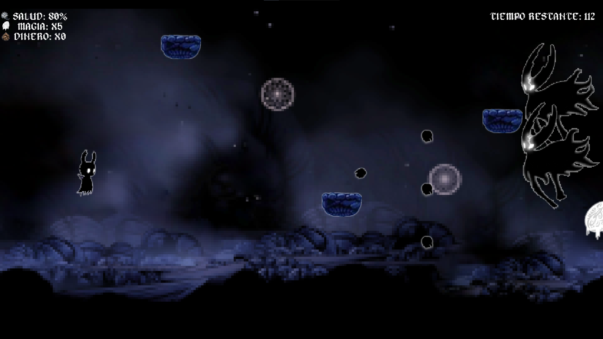  |
|                        Menu Pausa/Pause Menu                          |                         Jugabilidad/Gameplay                           |
| | |
| 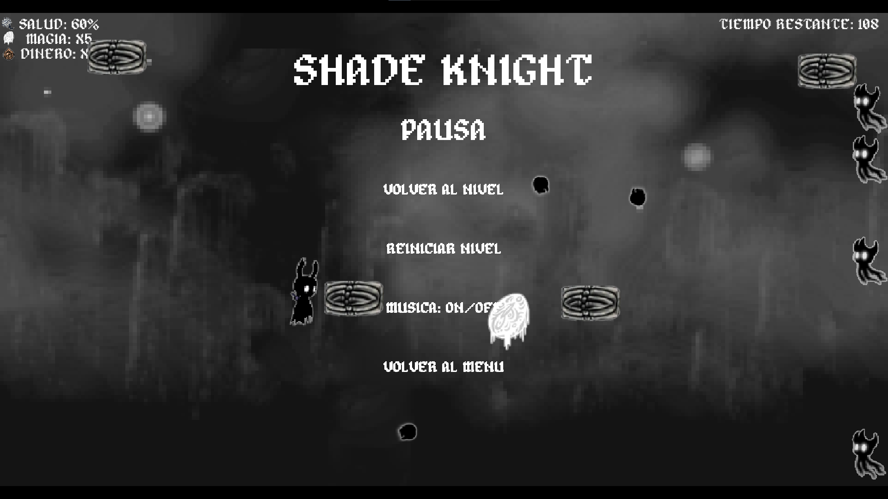| 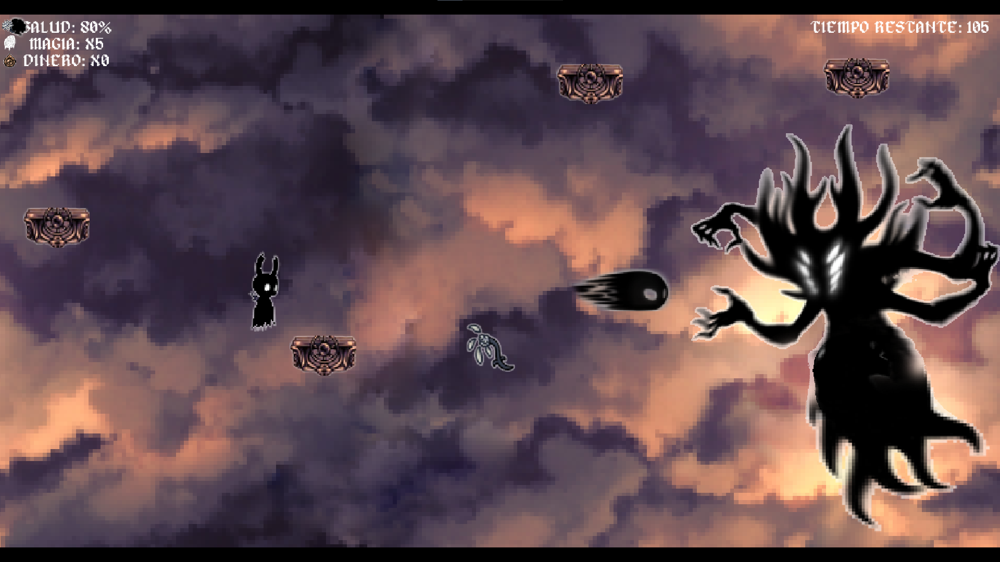  |


</details>

### Hecho con / Built With


> Hecho en Python con la biblioteca de Pygame. 

> Made in Python with Pygame library.

## Empezando / Getting Started

### Requisitos previos / Prerequisites


> Es necesario tener instalado python y pygame para poder ejecutar el juego desde el main. 

> It is necessary to have python and pygame installed to be able to run the game from main.

### Instalación / Installation


> Puede instalar Python utilizando el siguiente enlace: https://www.python.org/ . 
> 
> Pygame se puede instalar desde la terminal mediante el comando
> 
> ```sh
> pip install pygame
> ``` 
> 
> El repositorio se puede descargar desde <>Code -> Download ZIP. 

> To install Python use the following 
> link: https://www.python.org/ . 
> 
> Pygame can be installed from the terminal using the command
> 
> ```sh
> pip install pygame
> ``` 
> 
> The repository can be downloaded from <>Code -> Download ZIP.


|                        Descarga/Download                       |                        Descarga/Download                                |
| :-------------------------------------------------------------------: | :--------------------------------------------------------------------: |
| 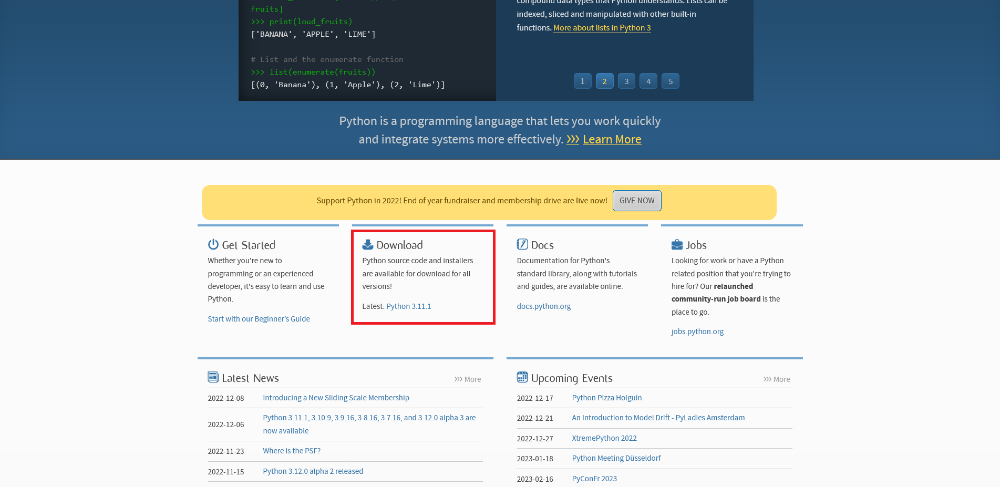  | 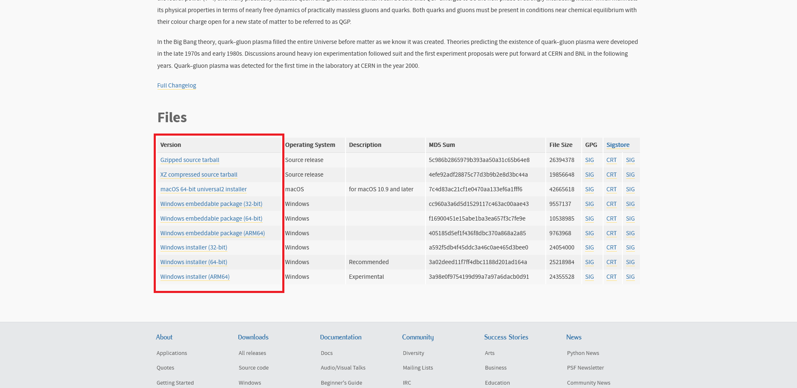  |
|                           Instalacion Python/Python Install       |                         Instalacion Pygame/Pygame Install                           |
|  |  |
| 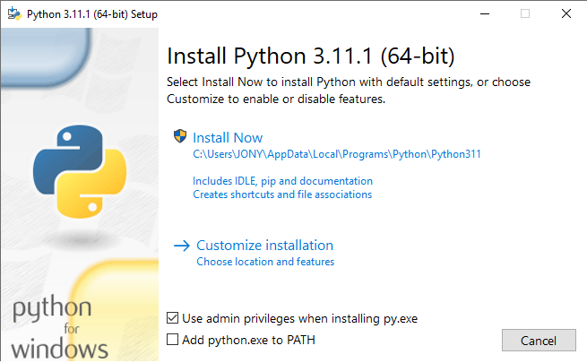    | 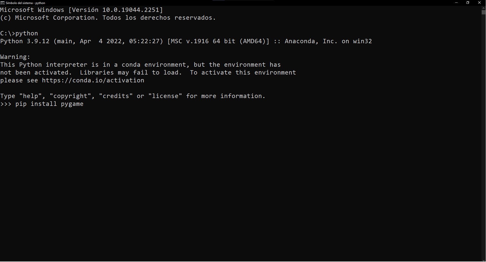  |
|                              Repositorio/Repository           |                 Carpetas/Folders                            |
| | |
| 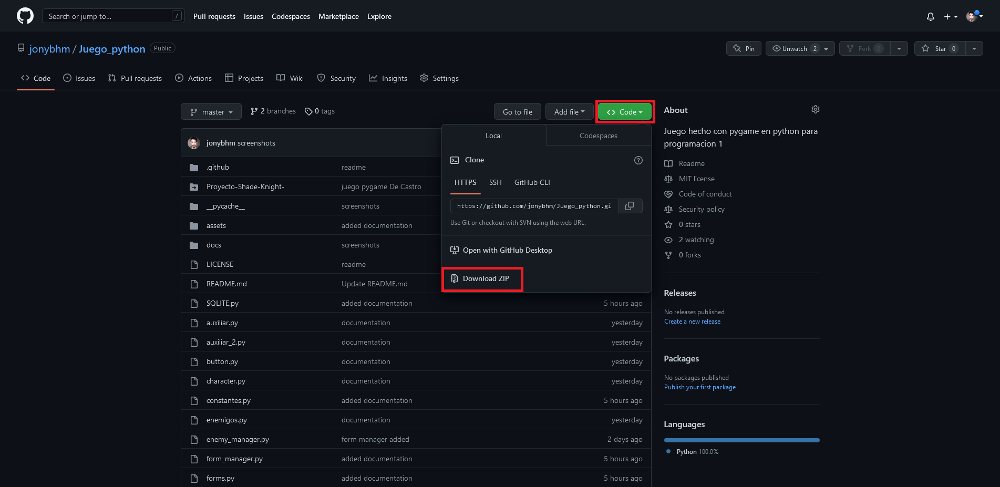| 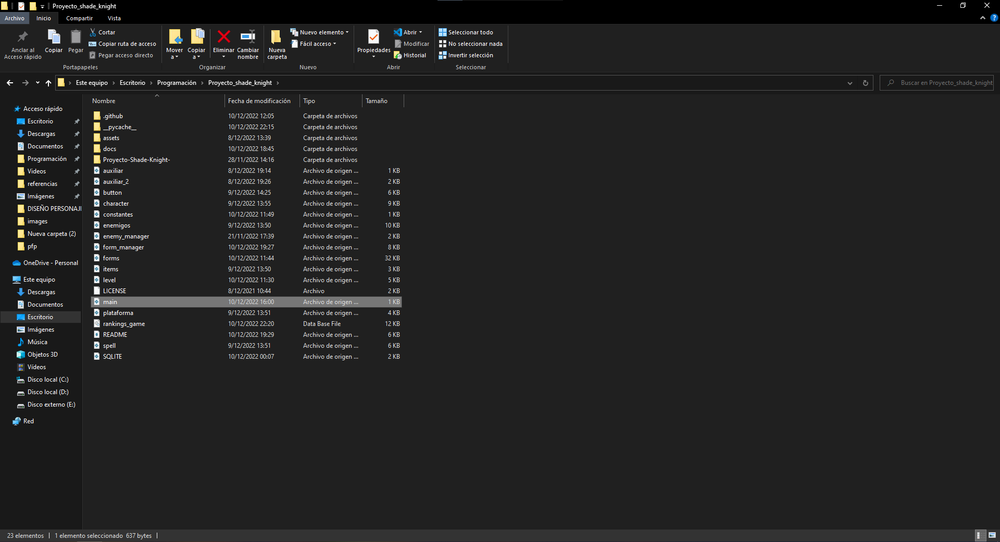  |

## Utilización / Usage


> El código y juego se puede utilizar como gusten y de forma libre, ya sea como base para otro código o con el fin de aportar a este mismo (como contribuir se explica más adelante).

> The code and game can be used as you like, freely, either as a base for another code or to contribute to this one (how to contribute next).

## Contribuciones / Contributing

Si desean contribuir por favor lea las [pautas de contribución](docs/CONTRIBUTING.md).Desde ya cualquier tipo de contribución es **muy apreciada**.

If you would like to contribute please read the [contribution guidelines](docs/CONTRIBUTING.md). Any tyoe of contribution is **greatly appreciated**.

## Autores y contribuyentes / Authors & contributors

El setup original del repositorio fue hecho por [Jonathan De Castro](https://github.com/jonybhm). 

Lista de [Contribuyentes](https://github.com/jonybhm/Shade_knight/contributors). 

The original setup of this repository is by [Jonathan De Castro](https://github.com/jonybhm).

List of [Contributors](https://github.com/jonybhm/Shade_knight/contributors).

## Licencia / License

Este proyecto está autorizado bajo la **Licencia Pública General de GNU V3.0**.

Consulte [LICENCIA](LICENSE) para obtener más información.

This project is licensed under the **GNU General Public License V3.0**.

See [LICENSE](LICENSE) for more information.

## Reconocimientos / Acknowledgments


> Este mini juego esta inspirado por [Hollow Knight](https://www.hollowknight.com/) creado por [Team Cherry](https://www.teamcherry.com.au/) y es un tributo al mismo. Copyright © 2021 Team Cherry

> La música utilizada es un arreglo hecho por [MakiOST](https://www.youtube.com/@MakiOST) en [HollowBit Project](https://youtube.com/playlist?list=PLyd73Ll0_1o-qragyllGsnO4qMhcWhau-) 

> This mini game is inspired by [Hollow Knight](https://www.hollowknight.com/) created by [Team Cherry](https://www.teamcherry.com.au/) and is a tribute to it. Copyright © 2021 Team Cherry

> The music used is an arrangement made by [MakiOST](https://www.youtube.com/@MakiOST) in [HollowBit Project](https://youtube.com/playlist?list=PLyd73Ll0_1o-qragyllGsnO4qMhcWhau-)
